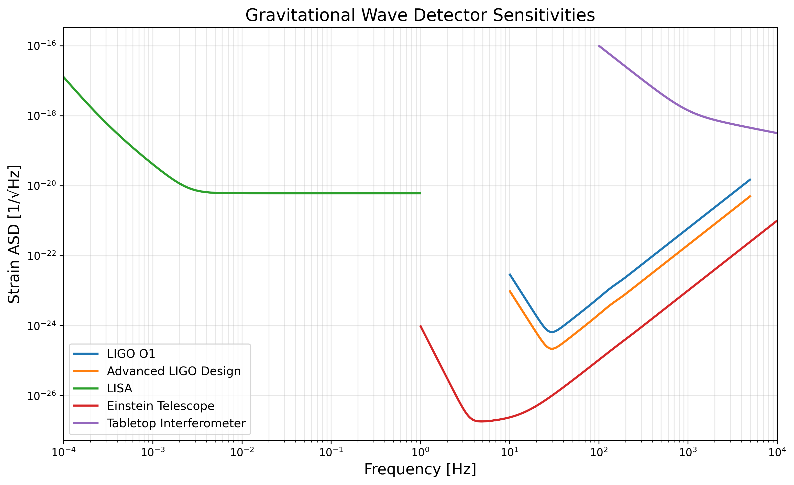

# Discovery Engine Guide

## Overview

The **Extreme-Field QED Simulator** has evolved into a comprehensive **discovery engine** for systematically searching for new physics in gravitational coupling, vacuum structure, and spacetime interactions. This guide explains how to use the framework to:

1. **Compute precise predictions** from known physics (QED + GR)
2. **Parameterize ignorance** via κ-ansätze for unknown couplings
3. **Run systematic parameter sweeps** across source configurations
4. **Derive experimental constraints** from null results
5. **Publish discovery reach** curves and κ-upper-bounds

---

## Core Methodology: κ-Constraint Framework

### The Big Idea

Most experiments searching for new physics yield **null results**. Instead of discarding these, we turn them into **meaningful constraints**:

> **"We didn't see anything, therefore new physics coupling κ must be smaller than X."**

### How It Works

1. **Baseline Prediction**: Compute gravitational wave strain `h_EM` from pure electromagnetic stress-energy using Einstein's equations:
   ```
   h_ij(t, R) ≈ (2G/c⁴R) Q̈_ij(t)
   ```
   where `Q_ij` is the mass-energy quadrupole moment.

2. **Anomalous Coupling**: Model unknown physics as an effective modification to stress-energy:
   ```
   T^μν_eff = T^μν_EM + κ F^μν[fields, ...]
   ```
   where:
   - `κ` = dimensioned coupling strength (to be constrained)
   - `F^μν` = "functional" chosen from physics-motivated ansätze

3. **Detection Threshold**: Compare `h_EM` to detector sensitivity (LIGO, LISA, quantum sensors):
   - If `h_EM` < threshold → signal is undetectable with known physics alone
   - Anomalous coupling must boost strain to threshold for detection

4. **κ-Constraint**: Solve for required κ:
   ```
   h_total ≥ h_threshold  ⟹  κ ≥ κ_required
   ```
   **Null result** (no detection) implies: **κ < κ_required**

---

## Ansätze Catalog

The framework provides 7 physics-motivated ansätze:

### 1. **Vector Potential Squared** (`vector_potential_squared`)
```python
F ∝ |A|² η^μν
```
- **Motivation**: Beyond-SM theories with direct gravity–vector-potential coupling
- **Units**: `[κ] = J·s²/(kg·m⁴)`
- **Use Case**: Test gauge-field–gravity interactions

### 2. **Field Invariant F²** (`field_invariant_F2`)
```python
F ∝ (B² - E²/c²)² / (16ε₀²)
```
- **Motivation**: Lorentz-invariant coupling to first EM field invariant
- **Units**: Dimensionless or `[κ] = J·m³`
- **Use Case**: Standard QFT-like couplings

### 3. **Photon Number** (`photon_number`)
```python
F ∝ n_γ = u/(ħω)
```
- **Motivation**: Quantum gravity proposals scaling with coherent photon number
- **Units**: `[κ] = J·s`
- **Use Case**: High-Q cavity experiments with ~10¹⁵ photons

### 4. **Axion-Like (Parity-Odd)** (`axion_like`)
```python
F ∝ E·B
```
- **Motivation**: Axion–photon coupling `g_aγγ a F F̃` where `F̃^μν = ε^μνρσ F_ρσ/2`
- **Units**: `[κ] = J·m/(V·T)` maps to `g_aγγ × a₀`
- **Use Case**: ALP searches; compare to CAST/ADMX constraints `g_aγγ < 10⁻¹⁰ GeV⁻¹`
- **Parity**: Violating (pseudoscalar)

### 5. **Dilaton-Like (Scalar-Tensor)** (`dilaton_like`)
```python
F ∝ T^μ_μ  (with QED corrections: α/π × F² / E_s²)
```
- **Motivation**: Brans-Dicke, dilaton gravity coupling scalar φ to trace
- **Units**: Dimensionless or `[κ] = ⟨φ⟩` (scalar VEV)
- **Use Case**: Tests of scalar-tensor modifications; conformal anomaly effects

### 6. **Chern-Simons-Like (Lorentz-Violating)** (`chern_simons_like`)
```python
F ∝ A·B  (proxy for k^μ ε_μνρσ A^ν F^ρσ)
```
- **Motivation**: Standard Model Extension (SME) Lorentz violation
- **Units**: Depends on k^μ; typically dimensionless or `1/GeV`
- **Use Case**: SME bounds `|k^μ| < 10⁻¹⁵ – 10⁻³²`
- **Parity**: Violating

### 7. **Spatial Gradient** (`spatial_gradient`)
```python
F ∝ ∇·(|A|²)
```
- **Motivation**: Localized coupling near sources/boundaries
- **Units**: Similar to vector_potential_squared
- **Use Case**: Geometry-dependent signatures

---

## Detector Sensitivities

The framework includes realistic noise models for major gravitational wave detectors:

| Detector | Frequency Band | Strain ASD @ 100 Hz | Integration Time |
|----------|----------------|---------------------|------------------|
| **LIGO O1** | 10 Hz – 5 kHz | ~3×10⁻²² Hz⁻¹/² | 1 hour |
| **aLIGO Design** | 10 Hz – 5 kHz | ~1×10⁻²² Hz⁻¹/² | 1 hour |
| **LISA** | 0.1 mHz – 1 Hz | ~1×10⁻²⁰ Hz⁻¹/² | 1 year |
| **Einstein Telescope** | 1 Hz – 10 kHz | ~1×10⁻²⁴ Hz⁻¹/² | 1 hour |
| **Quantum Sensor (Aspirational)** | 1 Hz – 1 MHz | ~1×10⁻³⁰ Hz⁻¹/² | 1 second |
| **Tabletop Interferometer** | 0.1 Hz – 10 kHz | ~1×10⁻¹⁸ Hz⁻¹/² | 100 seconds |

**SNR Calculation**: Matched-filter SNR via band integration:
```
SNR² = 4 ∫ |h̃(f)|² / S_n(f) df
```
where `S_n(f) = [ASD(f)]²` is the power spectral density.

**Detection Criterion**: `SNR ≥ 5` (5-sigma) for confident detection.



---

## Running Experiments

### Single Experiment

```bash
python scripts/run_experiments.py --config configs/experiments.yaml --experiment experiment_1
```

**Output**:
- `results/experiment_1.h5`: HDF5 file with strain timeseries, power, quadrupole, metrics
- Terminal summary: h_rms, P_avg, κ_required for each detector

### Parameter Sweep

```bash
python scripts/run_experiments.py --config configs/sweeps.yaml --sweep sweep_E0_colliding_pulses
```

**Output**:
- `results/sweeps/E0_colliding_pulses/`: Directory with individual HDF5 per sweep point
- `sweep_E0_colliding_pulses_summary.csv`: Consolidated table with columns:
  - `sweep_value`: Parameter value (e.g., E₀ = 10¹⁴ V/m)
  - `R_10.0m_h_rms`, `R_10.0m_P_avg`: Strain and power at 10 m
  - `kappa_<ansatz>_<detector>`: Required κ for each ansatz–detector pair
- `sweep_E0_colliding_pulses_plots.png`: Auto-generated 2×2 plot grid

**Example Sweep Configurations** (in `configs/sweeps.yaml`):
- `sweep_E0_colliding_pulses`: Peak field 10¹³ → 10¹⁶ V/m (7 points)
- `sweep_waist_colliding_pulses`: Focal spot 0.5 → 20 μm (6 points)
- `sweep_Q_cavity`: Cavity Q-factor 10⁵ → 10⁹ (5 points)

---

## Creating Custom Sweeps

### YAML Template

```yaml
my_custom_sweep:
  description: "Brief description of sweep purpose"
  
  geometry:
    type: "colliding_pulses"  # or "cavity_mode", "plasma_toroid", etc.
    parameters:
      E0: 1.0e15  # Base value; will be overridden by sweep
      waist: 5.0e-6
      wavelength: 800.0e-9
      pulse_duration: 10.0e-15
      collision_delay: 0.0
      polarization: "linear"
  
  grid:
    x_min: -20.0e-6
    x_max: 20.0e-6
    nx: 31  # Balance resolution vs. compute time
    # ... y, z similarly
  
  time_evolution:
    t_start: -15.0e-15
    t_end: 15.0e-15
    nt: 51
  
  physics:
    heisenberg_euler: true
    pair_production: true
    qed_stress_energy: true
  
  gravitational:
    observer_distances: [1.0, 10.0, 100.0]  # Multiple R for 1/R scaling check
    use_spectral_derivatives: true  # FFT-based (more stable for noisy Q̈)
    apply_TT_projection: true  # Transverse-traceless gauge
  
  anomalous_coupling:
    ansatze: ["axion_like", "dilaton_like", "field_invariant_F2"]
    kappa_scan: false
  
  detection_thresholds:
    LIGO: 1.0e-21
    aLIGO: 1.0e-22
    Einstein_Telescope: 1.0e-23
    quantum_sensor: 1.0e-30
  
  # SWEEP SPECIFICATION
  sweep_parameter: "geometry.parameters.E0"  # Dot-separated path to nested param
  sweep_values: [1.0e14, 3.0e14, 1.0e15, 3.0e15, 1.0e16]  # List of values
  
  output:
    sweep_dir: "results/sweeps/my_custom_sweep"
    save_fields: false  # Set true to save snapshots (large files!)
    save_quadrupole: true
    save_strain: true
    save_metrics: true
```

**Sweep Parameter Paths**:
- `"geometry.parameters.E0"`: Peak electric field
- `"geometry.parameters.waist"`: Gaussian beam waist
- `"geometry.parameters.Q_factor"`: Cavity quality factor
- `"grid.nx"`: Grid resolution (use cautiously; affects all dimensions)
- `"time_evolution.nt"`: Time resolution

---

## Interpreting Results

### Expected Scaling Laws

1. **Strain vs. Energy Density**:
   ```
   h ∝ Q̈ ∝ T₀₀ ∝ E²  ⟹  h ∝ E₀²
   ```
   Doubling E₀ → 4× strain

2. **Radiated Power**:
   ```
   P_GW ∝ (d³Q/dt³)² ∝ E₀⁴
   ```
   Doubling E₀ → 16× power

3. **Distance Scaling**:
   ```
   h(R) = h(R₀) × (R₀/R)
   ```
   10× distance → 1/10 strain

4. **κ-Constraint Scaling**:
   ```
   κ_required ∝ (h_threshold / h_EM) ∝ 1/E₀²
   ```
   Higher field → smaller required κ → **stronger constraint**

### Physical Benchmarks

**Schwinger Field**: E_s = m²c³/(eℏ) ≈ 1.3×10¹⁸ V/m
- Below E_s: Perturbative QED (Heisenberg-Euler)
- Near E_s: Non-perturbative pair production dominates

**Planck Energy Density**: ρ_Pl = c⁷/(Gℏ) ≈ 10¹¹³ J/m³
- Quantum gravity effects expected near this scale

**PVLAS Limit** (vacuum birefringence):
- Observed: null at Δn ~ 10⁻²⁰
- QED prediction (1-loop HE): Δn ~ 10⁻²³ at E ~ 10⁵ V/m, B ~ 5 T
- Framework can reproduce and extend to higher fields

---

## Publication-Quality Outputs

### From Sweep CSV

```python
import pandas as pd
import matplotlib.pyplot as plt

# Load sweep results
df = pd.read_csv('results/sweeps/E0_colliding_pulses/sweep_E0_colliding_pulses_summary.csv')

# Discovery reach plot
fig, ax = plt.subplots(figsize=(10, 7))
ax.loglog(df['sweep_value'], df['kappa_axion_like_LIGO'], 'o-', label='Axion-like (LIGO)')
ax.loglog(df['sweep_value'], df['kappa_dilaton_like_aLIGO'], 's-', label='Dilaton-like (aLIGO)')
ax.set_xlabel('Peak Field E₀ [V/m]', fontsize=14)
ax.set_ylabel('κ_required for Detection', fontsize=14)
ax.set_title('Discovery Reach: New Physics Coupling Constraints', fontsize=16)
ax.legend()
ax.grid(True, alpha=0.3, which='both')
ax.axhline(1e30, color='red', linestyle='--', alpha=0.5, label='Naturalness scale')
plt.savefig('discovery_reach.png', dpi=300, bbox_inches='tight')
```

### From HDF5 (Single Experiment)

```python
import h5py
import numpy as np

with h5py.File('results/colliding_pulses_qed.h5', 'r') as f:
    h_t = f['gravitational/R_10.0m/h_timeseries'][:]  # (T, 3, 3)
    P_t = f['gravitational/R_10.0m/P_timeseries'][:]  # (T,)
    
    # Extract h_+ polarization (assuming TT gauge, +z propagation)
    h_plus = h_t[:, 0, 0]  # xx component
    
    # Plot
    fig, (ax1, ax2) = plt.subplots(2, 1, figsize=(12, 8))
    ax1.plot(h_plus, linewidth=0.8)
    ax1.set_ylabel('Strain h_+')
    ax1.grid(True, alpha=0.3)
    
    ax2.semilogy(P_t, linewidth=1.0, color='darkred')
    ax2.set_xlabel('Time Step')
    ax2.set_ylabel('Radiated Power [W]')
    ax2.grid(True, alpha=0.3)
    
    plt.tight_layout()
    plt.savefig('strain_power_timeseries.png', dpi=300)
```

---

## Best Practices

### 1. **Grid Resolution**
- Start coarse (nx=15) for parameter space exploration
- Refine (nx=31–51) for publication-quality runs
- Check convergence: does doubling nx change h_rms by <1%?

### 2. **Time Evolution**
- Cover at least 2–3 pulse durations for transients to pass
- Use nt ≥ 50 for clean FFT frequency spectra
- Enable `use_spectral_derivatives=true` for stability

### 3. **Ansatz Selection**
- Use `axion_like` for parity-odd searches
- Use `dilaton_like` for scalar-tensor tests
- Use `field_invariant_F2` as baseline (Lorentz-invariant, parity-even)
- Run all ansätze in sweeps to build comprehensive constraint matrix

### 4. **Detector Choice**
- LIGO/aLIGO: Near-term realistic (10–5000 Hz)
- LISA: Space-based (mHz range), ideal for low-frequency sources
- Quantum sensors: Aspirational (h~10⁻³⁰), sets ultimate limits
- Include multiple detectors to span frequency space

### 5. **Computational Efficiency**
- Disable `save_fields: true` unless debugging (huge files)
- Use `pair_production: false` if E₀ ≪ E_s (saves time)
- Run sweeps on clusters: each point is independent (embarrassingly parallel)

---

## Troubleshooting

### **Q**: Strain values are ~10⁻⁶⁰, way below any detector. Is this wrong?

**A**: No! Extreme-field QED produces *tiny* quadrupole moments due to:
1. Small spatial scale (μm focal spots)
2. Cancellation in symmetric field configurations
3. Radiation distance R (strain ∝ 1/R)

**Solutions**:
- Increase E₀ (strain ∝ E₀²)
- Increase source volume (larger waist or cavity)
- Bring detector closer (R = 1 m vs. 10 m)
- Use asymmetric geometry (rotating capacitor, counter-rotating rings)

### **Q**: κ_required is enormous (10⁵⁰). What does this mean?

**A**: The anomalous coupling would need to be *unnaturally large* to produce a detectable signal. This is **good**—it means:
- Known physics (EM + GR) predicts nearly zero signal
- Any detection would indicate strong new physics
- Null result constrains κ < 10⁵⁰ (useful if theory predicts κ ~ 10⁴⁰)

### **Q**: Why do axion-like constraints differ from field_invariant_F2?

**A**: Different ansätze have different:
1. **Units** (κ dimensions vary)
2. **Symmetries** (axion is parity-odd; F² is parity-even)
3. **Field dependence** (E·B vs. E²)

Compare κ-constraints **within the same ansatz** across different experiments.

### **Q**: Sweep plots show non-monotonic κ vs. E₀. Bug?

**A**: Likely due to:
- Frequency spectrum shifting out of detector band as E₀ changes
- Destructive interference in certain field configurations
- Numerical noise in low-signal regime

**Check**:
1. Plot h_rms vs. E₀ (should be monotonic)
2. Plot peak frequency vs. E₀
3. Increase grid resolution or integration time

---

## Next Steps: Advanced Topics

### 1. **Bayesian κ Inference**
Instead of point estimates, compute posterior distributions:
```
P(κ | data, model) ∝ P(data | κ, model) × P(κ)
```
Use MCMC (emcee, PyMC3) to sample posteriors and plot credible intervals.

### 2. **Multi-Geometry Comparisons**
Run same ansatz across:
- Colliding pulses (pulsed, high-field)
- Cavity modes (CW, high-Q)
- Plasma toroid (rotating, low-frequency)

Build "discovery matrix": best geometry × ansatz pair for each physics scenario.

### 3. **Experimental Proposals**
Use κ-constraint plots to guide:
- Laser facility designs (target E₀, focus)
- Cavity specifications (Q, finesse)
- Detector requirements (bandwidth, integration time)

Optimize cost–benefit: which upgrade path improves κ-reach most?

### 4. **SME Coefficient Mapping**
For Lorentz-violating ansätze, map κ → SME coefficients:
- `c^μν`: CPT-even, parity-even
- `k^μν`: CPT-odd, parity-odd

Compare to existing bounds from:
- Astrophysical birefringence (radio polarization)
- Laboratory tests (spin-polarized torsion balance)
- Collider limits (photon sector)

---

## References

### Theoretical Background
1. **Heisenberg-Euler QED**:
   - W. Heisenberg & H. Euler, Z. Phys. **98**, 714 (1936)
   - J. Schwinger, Phys. Rev. **82**, 664 (1951)
   - Two-loop: Gies & Karbstein, JHEP **1703**, 108 (2017)

2. **Gravitational Wave Production**:
   - Landau & Lifshitz, *Classical Theory of Fields* (Ch. 11)
   - Misner, Thorne & Wheeler, *Gravitation* (Ch. 36)
   - Rothman & Boughn, "Can Gravitons Be Detected?" Found. Phys. **36**, 1801 (2006)

3. **Axion-Photon Coupling**:
   - CAST: Nature Phys. **13**, 584 (2017)
   - ADMX: Phys. Rev. Lett. **120**, 151301 (2018)

4. **Standard Model Extension**:
   - Kostelecký & Mewes, Phys. Rev. D **80**, 015020 (2009)

### Experimental Limits
- **PVLAS**: Phys. Rev. D **77**, 032006 (2008)
- **LIGO O1**: Phys. Rev. Lett. **116**, 061102 (2016)
- **Quantum Sensing**: Tobar et al., Phys. Rev. D **104**, 064054 (2021)

---

## Support

- **Issues**: https://github.com/arcticoder/extreme-field-qed-simulator/issues
- **Examples**: `configs/experiments.yaml`, `configs/sweeps.yaml`
- **Tests**: `pytest tests/` (validate installation)
- **Notebooks**: `notebooks/experiment_analysis.ipynb` (visualization templates)
